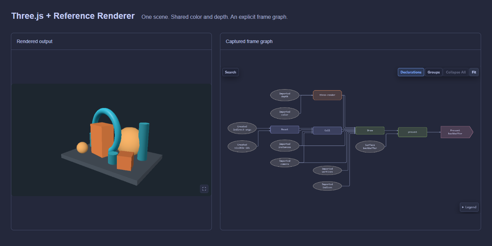

<!-- readme-hero:start -->

   
  <a href="https://uinosoft.github.io/zenfg/">
    <picture>
      <source media="(prefers-color-scheme: dark)" srcset="assets/brand/zenfg-lockup-dark.svg">
      <source media="(prefers-color-scheme: light)" srcset="assets/brand/zenfg-lockup-light.svg">
      
    </picture>
  </a>
   

  <strong>A composable FrameGraph for WebGPU and wgpu.</strong>

<!-- generated:badges:start -->

<!-- generated:badges:end -->

  <a href="https://uinosoft.github.io/zenfg/">Website</a> ·
  <a href="https://uinosoft.github.io/zenfg/docs/">Documentation</a> ·
  <a href="https://uinosoft.github.io/zenfg/playground/">Examples</a> ·
  <a href="https://uinosoft.github.io/zenfg/inspector/">Inspector</a>

  <strong lang="en">English</strong> · <a href="README.zh-CN.md" lang="zh-CN">简体中文</a>

<!-- readme-hero:end -->

# ZenFG

**Build rendering features, compose GPU systems, and understand every frame.**

ZenFG coordinates rendering and compute through an explicit FrameGraph.
Build domain-specific features with WebGPU or wgpu, connect existing engines,
and compose their work in one frame. You control scenes, materials, pipelines,
and rendering policy; ZenFG coordinates declared dependencies, execution order,
transient resource lifetimes, and diagnostics. Idiomatic TypeScript and Rust
runtimes share semantics and portable Snapshots, with an embeddable Inspector.

## Why ZenFG

- **Build independently** — Use native GPU APIs or compatible libraries while keeping your own renderer architecture.
- **Compose existing work** — Combine external engines with graph-native rendering and compute modules through explicit shared resources and execution boundaries.
- **Understand actual frames** — Inspect graphs, resources, and optional CPU/GPU timings. Export Snapshots alongside code for human or AI-assisted analysis, then capture again to verify changes.
- **Coordinate dependencies and resources** — Retain required work, cull unused work, and manage transient allocation, lifetimes, aliasing, and pooling.

<!-- readme-showcase:start -->

  

<!-- readme-showcase:end -->

[Three.js Co-rendering](https://uinosoft.github.io/zenfg/playground/?example=three-interop&panel=inspector): two renderers share color and depth attachments, with mutual occlusion in one scene.

Also explore GPU culling and indirect drawing in the [Reference Renderer](https://uinosoft.github.io/zenfg/playground/?example=reference-renderer&panel=inspector),
[PlayCanvas Streaming GSplat](https://uinosoft.github.io/zenfg/playground/?example=playcanvas-gsplat-streaming-interop&panel=inspector) (network required), and
[TypeGPU Slime Mold](https://uinosoft.github.io/zenfg/playground/?example=typegpu-slime-mold&panel=inspector) compute and render nodes.
These are version-specific integration examples, not a universal compatibility promise.

## Start here

- **WebGPU / TypeScript** — Start with the
  [`@zenfg/webgpu` quick start](packages/webgpu/README.md#quick-start), then
  explore the [complete TypeScript recipes](packages/webgpu/examples/README.md).
- **wgpu / Rust** — Follow the
  [`zenfg` quick start](crates/zenfg/README.md#quick-start) and
  [Cargo examples](crates/zenfg/examples/).
- **Try it online** — Explore the
  [live examples](https://uinosoft.github.io/zenfg/playground/?example=interactive-background&panel=inspector)
  with their TypeScript source and Inspector captures, or open a Snapshot in
  the [Inspector](https://uinosoft.github.io/zenfg/inspector/). The Inspector
  runs entirely in the browser and does not upload imported snapshots.

Browse the [documentation index](docs/README.md) for guides and reference
material. Before changing public semantics, examples, or release artifacts,
read [Contributing](CONTRIBUTING.md).

## Integration levels

Connect an engine that keeps its own submissions, or build modules that record
work into the graph; both approaches can be combined. Technically, ZenFG offers
the three integration depths below.

Interoperability requires a shared device and queue, compatible resource formats
and usage contracts, and accurate access declarations. Import each shared native
resource once per recording. External-engine passes stay opaque; GPU timing
depends on device support and node coverage. Snapshots contain neither replayable
commands nor resource contents.

The application controls rendering policy and chooses how deeply each
subsystem integrates with the graph. ZenFG coordinates the work; scenes,
materials, and renderer architecture remain with the application.

| ZenFG owns | The application owns |
| --- | --- |
| Graph-visible dependencies and execution order | Scenes, materials, cameras, and renderer architecture |
| Retention roots and dead-work culling | Pipelines, bind groups, samplers, and draw/dispatch policy |
| Transient lifetimes, aliasing, and pooling | Devices, queues, surfaces, presentation, and device-loss policy |
| Validation, reports, Snapshot projection, and inspection | Long-lived resources, resource contents, and application state |

Three integration levels can be mixed in the same frame:

- **Native render, compute, and copy** nodes provide the richest validation and
  diagnostics.
- **Command integration** lets a subsystem encode custom work into a
  FrameGraph-owned command encoder.
- **Opaque external submission** lets an existing renderer keep its encoders
  and submission model while declaring an ordered graph boundary.

See [Core concepts](docs/core-concepts.md) for the complete ownership, content,
dependency, lifetime, and execution model.

## Packages

<!-- generated:packages:start -->
| Package | Purpose | Published version | Documentation |
| --- | --- | --- | --- |
| [`@zenfg/webgpu`](packages/webgpu/README.md) | TypeScript/WebGPU FrameGraph runtime |  | [Guide](https://uinosoft.github.io/zenfg/docs/packages/webgpu.html) |
| [`@zenfg/snapshot`](packages/snapshot/README.md) | Snapshot 1.2 types, codec, validation and specification |  | [Guide](https://uinosoft.github.io/zenfg/docs/packages/snapshot.html) |
| [`@zenfg/inspector`](packages/inspector/README.md) | Embeddable DOM Inspector |  | [Guide](https://uinosoft.github.io/zenfg/docs/packages/inspector.html) |
| [`zenfg`](crates/zenfg/README.md) | Rust/wgpu FrameGraph runtime |  | [Guide](https://uinosoft.github.io/zenfg/docs/packages/zenfg.html) |
| [`zenfg-snapshot`](crates/zenfg-snapshot/README.md) | Rust Snapshot 1.2 codec, validation and migration |  | [Guide](https://uinosoft.github.io/zenfg/docs/packages/zenfg-snapshot.html) |
<!-- generated:packages:end -->

## Direction

We are exploring reusable GPU-driven mesh, particle, and post-processing modules,
so independently built rendering features can come together in real applications.
This is a direction, not a delivery schedule or stable module protocol. The current
Reference Renderer is a teaching and showcase implementation, not a published
production rendering module.

## Status

ZenFG 0.1.0 is the first non-prerelease version. Public APIs may change before
1.0; integrations should pin exact package versions and review migration notes.

TypeScript and Rust share semantics and portable diagnostics, not source-level
API parity. Snapshot wire format versioning is independent from package
versions; see the [compatibility matrix](docs/compatibility.md) and
[changelog](CHANGELOG.md).

## License

ZenFG is available under the [MIT License](LICENSE).
