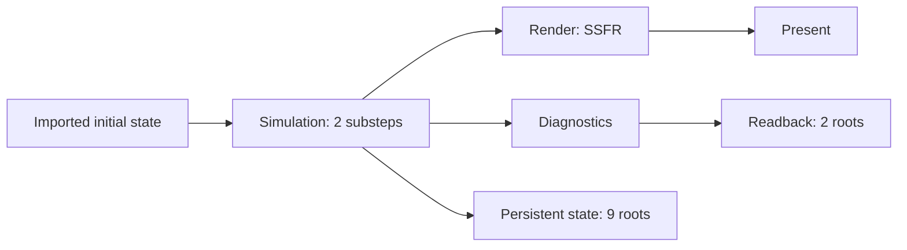

# Particles4All graph debugging review

Status: review and follow-up proposals, 2026-09-08. Baseline: `9ae7d71`.
The accepted implementation scope is the Particles4All example, its tests and
documentation: resource attribution, redundant groups and access precision.
Inspector navigation, projection changes and new public APIs are deferred to
a separate evaluation. The measurements below describe the baseline, not the
subsequent corrected implementation; see the example's VALIDATION.md for results.

Evidence: the user-provided `frame-graph-5.fgsnapshot.json`, frame 5 captured at
`2026-09-08T02:31:57.765Z`, the running Playground Inspector, the workload,
compiler, Inspector projection, and [resource declaration guidance](core-concepts.md#choosing-resource-declaration-granularity).

## Assessment

The detailed native integration is appropriate for a FrameGraph showcase. Its
current diagnostic organization is not yet a good default for exploring a
large workload. Keep the meaningful resource and pass declarations, improve
their accuracy, and make the Inspector show progressively more detail.

Three independent choices need explicit treatment:

1. Which GPU work and resources participate in the graph contract.
2. How much work one graph node encodes.
3. Which portion of that contract a debugging view currently displays.

Graph visibility provides validation, culling, allocation and diagnostic value.
It should not require a resource to appear as a separate node in every view.
Debug group membership is diagnostic attribution; it is neither resource
ownership nor an execution or allocation boundary.

## Measured complexity

| Fact | Captured value |
| --- | ---: |
| Retained execution nodes / culled nodes | 65 / 0 |
| Compute / render / clear-buffer / copy nodes | 47 / 13 / 3 / 2 |
| Simulation / diagnostics / rendering nodes | 46 / 3 / 16 |
| Simulation substeps / constraint iterations per substep | 2 / 4 |
| Debug groups | 34 |
| Resources: transient / imported / surface | 24 / 15 / 1 |
| Access declarations | 352 |
| Dependencies: value / ordering | 192 / 137 |
| Roots: persistent state / readback / present | 9 / 2 / 1 |
| Resources with a declared debug group | 0 of 40 |
| Native command segments / external submissions | 1 / 0 |
| Transient physical allocations | 23 |

These are one captured frame's values, not fixed workload limits. Time-bank
substeps, rendering mode, initialization, pouring and readback slot availability
change the recorded graph. A graph node is not necessarily a single dispatch:
the current grid scan encodes three dispatches, and rigid projection encodes six.

Running the actual `createDebugViewModel()` and `createGraphScene()` functions
against this file gives:

| Current projection | Visible nodes | Visible edges |
| --- | ---: | ---: |
| All groups collapsed | 53 | 52 |
| Only Particles4All expanded | 56 | 61 |
| All groups expanded | 151 | 383 |
| Groups disabled | 117 | 383 |

The 53-node collapsed view contains one workload group, 40 resource declarations,
and 12 root endpoints. The imported capture visibly becomes a tall column of
tiny resource symbols surrounding an almost invisible workload group when fit
to the viewport. This is a projection problem even before expanding any solver
detail. It is not evidence of 65 submissions or a GPU scheduling defect.

## Findings in the example

### Resource registration occurs outside the groups

[`recordFrameGraph()`](../examples/particles4all-framegraph/src/Particles4AllFeature.ts)
creates branch textures, simulation scratch and imports before entering
`withDebugGroup('Particles4All', ...)`. The recorder associates resources with
the group active at registration. Later node grouping cannot retroactively
attribute those resources.

Consequences extend beyond layout: the current group summary reports 40 inputs
for Particles4All and zero registered transients. That is consistent with the
current declaration-based summary, but does not communicate the workload's
actual external inputs or scratch usage.

A controlled projection experiment changed only resource `groupId` fields in
an in-memory copy of the capture: simulation scratch to Simulation, rendering
scratch to Render, statistics scratch/readbacks to Diagnostics, imported solver
state to Particles4All, and backbuffer left outside. No access, dependency,
root, node order or allocation was changed. The current Inspector then produced:

| Attribution-only experiment | Visible nodes | Visible edges |
| --- | ---: | ---: |
| All groups collapsed | 14 | 13 |
| Only Particles4All expanded | 30 | 35 |
| Workload and its three stages expanded | 63 | 90 |

This establishes the immediate benefit and the limit of fixing grouping alone.
These are measured projection counts, not a browser-tested implementation.

Move registrations into the intended existing scopes by arranging recording
helpers to create and return their resources there. CPU preparation can remain
outside a recording scope. Scratch shared by initialization and simulation
belongs at their common diagnostic ancestor. Do not create a second group with
the same label expecting to reopen the first: each `withDebugGroup()` creates a
distinct group. Do not split one shared native import into duplicate handles.

### Most current resources earn their graph visibility

| Resource class | Recommended treatment |
| --- | --- |
| Camera/frame uniforms, fixed boundary samples, fixed geometry, environment | Keep internally bound, as currently implemented, while uploads/lifetime stay workload-owned. Expose them when another graph participant produces or consumes them. |
| Live position, velocity, body/rest state and conditional rigid state | Keep accurate imported accesses and persistent roots for required final values. |
| Density and cell grid | Keep declarations: simulation produces them and rendering/diagnostics consume them; paused frames and mode changes also matter to their persistence policy. |
| Prediction, lambda, corrections, normals and grid scratch | Keep transient declarations in this showcase: they support multi-node data flow, initialized-range validation and allocation analysis. Hide their declaration symbols in a collapsed scope. |
| SSFR depth/filter/thickness textures, surface buffers and packed solids | Keep the current branch's transient declarations and complete accesses. |
| Readback staging and backbuffer | Keep the corresponding roots and accesses; aggregate their presentation in the UI when useful. |
| Scratch fully enclosed inside one compute callback | Can be internal in a production integration if graph allocation and diagnostics are unnecessary. Evaluate a whole resource lifetime and every use together. |

The capture contains an actual shared physical allocation for
`particles4all.simulation.pred-b` and `particles4all.ssfr.anisotropy` (a 1 MiB
allocation). Moving this scratch outside the graph would give up an observed
allocation benefit unless another allocator replaces it. Grouping must preserve
aliasing across diagnostic boundaries.

The busiest dependency resources are prediction A (39 edges), cellStart (38),
prediction B (36), and lambda (22). These are central solver data, not incidental
camera uniforms. Removing them solely to reduce line count would conceal the
work this example is intended to demonstrate.

Persistent roots must follow actual cross-frame requirements, including pause,
zero-substep frames, parity and conditional writes. They do not establish
automatic inter-frame dependencies. Avoid deleting roots based only on the
active SSFR frame, or replacing them with a blanket side effect.

### Audit accesses at the whole-node boundary

`recordCompute()` currently converts separate read and write lists into access
tokens. Several resources have both a read and a preserving write in one node.
This can increase the access-table noise without changing the required value
dependency. A preserving storage write already consumes prior contents; any
helper simplification must retain the required access kind and byte range.

A more consequential audit target is grid prefix scan. Its three dispatches
write `cellStart[0..nCells]` during that same callback; the later dispatch reads
values generated by the earlier dispatch. The current graph declaration reads
and preserves `cellStart`, including capacity through `nCells + 2` entries. The
capture consequently includes a value edge from the first substep's scan to the
second substep's scan, in addition to the necessary ordering hazards.

Audit the complete scan as a node: distinguish the GPU-consumed prefix from
unused capacity, then describe the fully produced prefix as overwrite when
proven. Audit scan-block scratch similarly. Update later accesses and roots
consistently with verified bounds. Do not change the whole allocation to
overwrite while retaining an unwritten padding element in the declared range.
This is a supported declaration improvement, not a reason to weaken compiler
validation. It requires range and content regression tests before changing code.

Conditional rigid updates still require preservation: for example, body seed
and resolve return when a body has no accumulated particles. Do not apply a
blanket overwrite conversion based on shader `read_write` binding syntax.

### Group and label granularity

Eight `Rigid Projection` groups each wrap one node. These add a sixth hierarchy
level without adding a useful navigational boundary. Keep the node and its
timing; remove the redundant group or elide singleton groups in presentation.
Retain Simulation, Substep, Grid, Constraints, Iteration, Finalize, Diagnostics,
Render and the active rendering branch as useful scopes.

Show group-relative labels such as `lambda`, `delta` and `rigid-projection`
inside an iteration. Retain full labels and identities in tooltips, search,
details and exported data. Repeated namespace prefixes currently consume the
small label area before the distinguishing operation is visible.

## Deferred: Inspector design

Keep the complete canonical capture. Build a task-oriented projection before
layout, rather than hiding already-laid-out objects with CSS or removing facts
from compilation reports.

The default workload view should expose Simulation, Diagnostics and Render,
plus grouped imported-state inputs and result ports. Entering Simulation should
show its substeps; entering one substep should expose its stages; entering an
iteration should expose its three nodes. Provide a breadcrumb and a separate
full-graph mode. The exact symbol count depends on the capture.

An illustrative overview, not a new execution graph:

The browser already has group collapse, graph search, pass search/sorting and
resource lists. Extend these facilities with focus and boundary semantics;
adding another Collapse All button or adjusting spacing alone is insufficient.

Recommended projection rules:

1. Start with a selected group, node neighborhood, resource, or root. Derive
   included canonical IDs and the nearest visible representative for each.
   Focus changes display membership, not retention. Show omitted-work counts.
2. Hide declarations of transients whose retained accesses are fully enclosed
   by a collapsed scope. Keep their resource/alias details reachable. Preserve
   producer-consumer edges for resources crossing the scope boundary, even if
   their registration was inside the scope.
3. Separate declaration entrances, incoming values, ordering constraints and
   observable outputs. A created buffer first written inside a group is not an
   external data input. Current `declarationEntrances()` is explicitly a
   topological declaration model, not exact initial-content provenance.
4. Aggregate parallel edges by visible endpoints and relation class. The current
   key includes `resourceId`, leaving separate parallel lines for each resource.
   A summary edge should list all underlying resources and canonical relations
   when selected. Retain value and ordering distinctions.
5. Default to value flow for an overview; reveal ordering hazards on demand or
   while investigating the selected access. Display the hidden-hazard count and
   keep all facts available. Do not mutate compiler dependencies or silently
   perform transitive reduction that loses direct resource explanations.
6. Bundle root endpoints for presentation by scope and reason, while retaining
   every root key, range, resolved producer and initial-content contribution.
   Imported initial state and final persistent results remain distinct ports;
   do not invent a cross-frame edge or merge canonical roots.
7. Keep neighboring context as compact boundary ports during focus. Expanding
   a solver iteration should not also expand every unrelated resource and stage.
8. Apply scope consistently to Graph, Passes and Resources; expose a clear way
   to return to the whole capture. Keep existing search and sort controls.
   Prioritize a concrete question such as “who produces the value consumed by
   this pass?” or “why is this stage retained?” over a full-capture highlight.

Group input/output summaries should distinguish produced/consumed values from
registration locations and ordering-only contacts. Exact subrange initial-value
provenance is not present in dependency tuples today; label any reconstruction
as derived and handle unavailable legacy facts explicitly.

Memory summaries must distinguish registered resources, accessed resources and
physical allocations. Shared allocations cannot be added across nested or
overlapping scopes as though each owns separate memory. Keep measured pass sums
distinct from GPU spans, CPU compile time and layout time.

## Deferred: architecture and API implications

The current boundary between compiler facts, Snapshot and Inspector is useful:
the compiler should preserve complete correctness facts, while Inspector owns
presentation. A diagnostic group must remain transparent to node ordering,
culling, lifetime analysis and cross-group reuse.

The first implementation can use existing APIs and Snapshot 1.1. Resource
registration scopes, parent groups, access tables, dependency kinds, root
resolutions and allocation IDs already support the main improvements.

Implementation seams are:

- [`debugCaptureModel.ts`](../packages/inspector/src/debugCaptureModel.ts): scope
  indices and distinct summaries of registration, usage and boundary flow.
- [`panelGraphScene.ts`](../packages/inspector/src/panelGraphScene.ts): focus,
  boundary ports, grouped root endpoints and relation aggregation. Extend its
  internal edge representation beyond one required `resourceId`, retaining
  semantic references for every represented object.
- [`panelTypes.ts`](../packages/inspector/src/panelTypes.ts) and
  [`FrameGraphInspector.ts`](../packages/inspector/src/FrameGraphInspector.ts):
  scope/navigation state and bundle selection, distinct from resource selection.
- Graph view and layout: cache by capture plus projection settings, preserve
  focus anchors, and apply the layout budget after projection. Offer a smaller
  scope when the budget is exceeded; preserve tables as the fallback.

Only consider new runtime APIs after those changes expose a remaining need.
A recording-local diagnostic group handle or explicit resource attribution
could help when resource preparation and pass recording must occur in different
places. It needs defined recording ownership, parent identity, duplicate-label
behavior and GPU marker semantics. Avoid making mutable handles or labels into
implicit execution scopes merely to repair this example's layout.

A separate future capability is precise dependency explanations. Snapshot 1.1
stores `(fromNodeId, toNodeId, resourceId, kind)`; it does not identify the exact
source/destination access pair, overlapping region, or distinguish WAR from
WAW within `ordering`. If debugging requires authoritative answers at that
level, emit optional provenance from the compiler's dependency analysis, with
care for multiple contributing regions/accesses per dependency. Prototype in a
namespaced extension, then evolve the portable schema and both runtime adapters
through the normal compatibility process. Never infer an exact explanation
from a coarse tuple and present it as a compiler fact.

There is no current evidence that this capture needs new scheduling, automatic
node merging, nested compiling subgraphs, or a generic renderer layer. The
existing scan/scatter/rigid nodes already demonstrate multiple dispatches within
a structured compute node. A production workload can choose coarser nodes with
accurate boundary accesses, accepting less internal culling, lifetime detail
and timing resolution. Changing execution granularity to repair Inspector
legibility would conflate separate problems. Measure CPU compile/encode cost
and GPU work before pursuing execution optimizations.

## Implementation scope and deferred follow-ups

Only the P0 example work below is accepted for this iteration. P1 and P2 remain
independent proposals; they are not dependencies or acceptance requirements for
the example changes. Inspector's default UI and complete topology remain intact.

| Priority | Work | Acceptance |
| --- | --- | --- |
| P0 | Fix workload resource attribution; simplify redundant groups and labels; audit scan ranges/accesses | Four rendering modes and lifecycle tests pass; persistent/readback roots remain correct; annotation-only changes preserve execution, dependencies and allocation plan; access corrections have explicit range tests. |
| P1 | Add scoped graph navigation, boundary summaries, edge/root aggregation and hazard visibility controls | This capture opens to a readable stage view; an individual iteration and a resource's producer/consumers are reachable without expanding the full graph; every summary drills down to exact canonical IDs. |
| P1 | Integrate scope with existing pass/resource tables and group summaries | Boundary inputs are distinguished from scratch declarations; selections stay meaningful when changing scope; memory/timing totals are correctly labeled. |
| P2 | Evaluate reusable diagnostic attribution and compiler dependency provenance | Introduce public API/protocol changes only for remaining, demonstrated requirements; preserve TypeScript/Rust semantics and legacy snapshot behavior. |

Use this capture as a measured complexity case and smaller synthetic fixtures
for invariants: grouped/ungrouped resources, private and shared transients,
repeated labels, conditional groups, multiple roots/ranges, initial-content
roots, mixed value/ordering dependencies, aliases across scopes, external
submission boundaries and unavailable legacy facts. Include four-mode captures,
first/stable/paused frames, pouring and parity variations in browser review.

For a presentation-only change, compare the underlying compiler reports before
and after. Projection tests should assert preserved semantic references, not
only smaller node counts or screenshot similarity. For a declaration change,
use the real compiler with fake GPU to prove valid ranges, retention and culling,
then exercise actual GPU pipelines. Document any performance measurement
separately from this static analysis.
